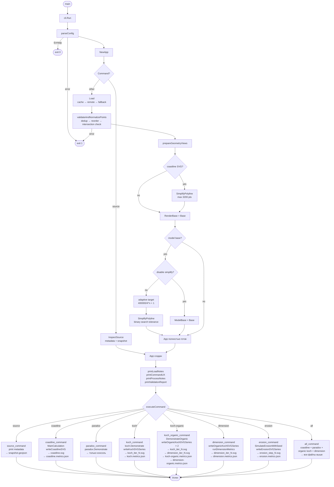
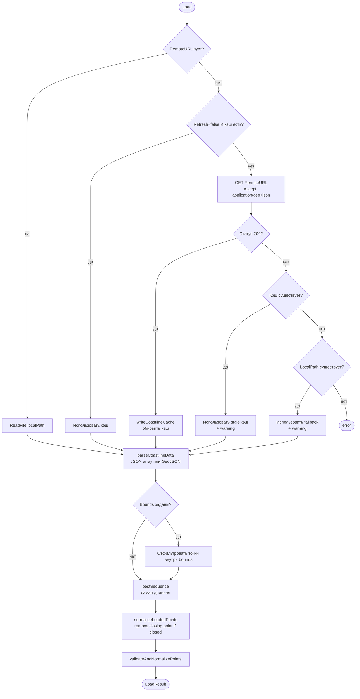
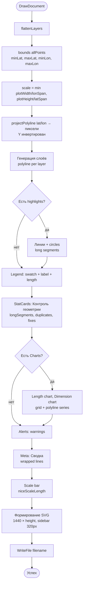
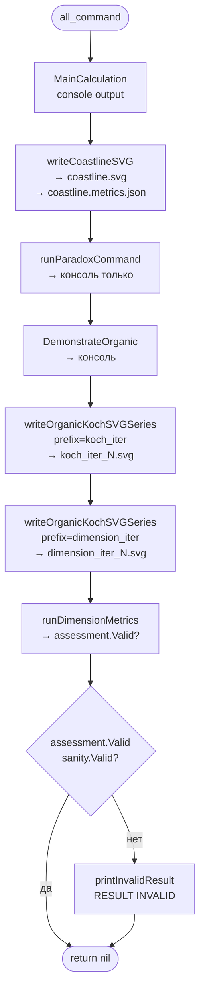

# Алгоритм FRAES

**Спецификация алгоритма**

Документ описывает каждый шаг выполнения программы от запуска бинарника до генерации выходных файлов.

---

## Содержание

- [Общая архитектура](#общая-архитектура)
- [Точка входа](#точка-входа)
- [Фаза 1: Парсинг конфигурации](#фаза-1-парсинг-конфигурации)
- [Фаза 2: Создание приложения и загрузка данных](#фаза-2-создание-приложения-и-загрузка-данных)
- [Фаза 3: Подготовка геометрии](#фаза-3-подготовка-геометрии)
- [Фаза 4: Информационный вывод](#фаза-4-информационный-вывод)
- [Фаза 5: Выполнение команды](#фаза-5-выполнение-команды)
  - [source](#source)
  - [real coastline](#real-coastline)
  - [model paradox](#model-paradox)
  - [model koch](#model-koch)
  - [model koch-organic](#model-koch-organic)
  - [model dimension](#model-dimension)
  - [model erosion](#model-erosion)
  - [all](#all)
- [Алгоритм загрузки данных](#алгоритм-загрузки-данных)
- [Алгоритм валидации](#алгоритм-валидации)
- [Алгоритм упрощения геометрии](#алгоритм-упрощения-геометрии)
- [Алгоритм SVG-рендеринга](#алгоритм-svg-рендеринга)
- [Алгоритм экспорта метрик](#алгоритм-экспорта-метрик)
- [Структуры данных](#структуры-данных)
- [Блок-схема](#блок-схема)

---

## Общая архитектура

```
cmd/fraes/main.go
    │
    ▼
cli.Run(args, stdout, stderr)
    ├── parseConfig()          → config
    ├── NewApp(cfg)            → App (загрузка + подготовка)
    ├── printLoadNotes()       → info/warning вывод
    ├── printCommandUX()       → canonical path, mode
    ├── printProcessNotes()    → process info
    ├── printValidationReport() → fixes/warnings
    └── executeCommand(app)    → dispatch → command runner
                                     │
                                     ├── domain/coastline/
                                     ├── domain/geometry/
                                     ├── domain/fractal/
                                     ├── domain/generators/koch/
                                     ├── domain/simulations/paradox/
                                     └── render/svg/
```

---

## Точка входа

```
main()
    │
    └── cli.Run(os.Args[1:], os.Stdout, os.Stderr)
```

---

## Фаза 1: Парсинг конфигурации

### `parseConfig(args, stdout, stderr) → config, error`

```
ВХОД: os.Args[1:]
ВЫХОД: config{Command, InputPath, SourceURL, Refresh, OutputPath,
              Iterations, Steps, Seed, AngleJitter, HeightJitter,
              ErosionStrength, ModelMaxPoints, DisableSimplify}
```

**Шаг 1.1: Проверка аргументов**
```
if len(args) == 0:
    printRootUsage()
    return ErrHelp

if isHelpToken(args[0]):  # "-h", "--help", "help"
    printRootUsage()
    return ErrHelp
```

**Шаг 1.2: Разрешение команды**
```
resolveCommand(args):
    │
    ├── args[0] == "real"  → resolveGroupedCommand("real", args[1:])
    │   ├── args[1] == "coastline" → command = "coastline"
    │   └── иначе → error
    │
    ├── args[0] == "model" → resolveGroupedCommand("model", args[1:])
    │   ├── args[1] ∈ {"paradox", "koch", "koch-organic", "dimension", "erosion"}
    │   └── иначе → error
    │
    └── args[0] ∈ {"source", "all", "coastline", "paradox", "koch",
                     "koch-organic", "dimension", "erosion"}
        └── command = args[0], commandArgs = args[1:]
```

**Шаг 1.3: Парсинг флагов**
```
fs := flag.NewFlagSet(command)

switch command:
    case "source":
        --input, --source-url, --refresh, --output

    case "all":
        --input, --source-url, --refresh, --output,
        --iterations (default: 5), --seed (default: 42),
        --angle-jitter (default: 18), --height-jitter (default: 0.25),
        --erosion-strength (default: 0),
        --model-max-points (default: 0), --no-model-simplify

    case "coastline":
        --input, --source-url, --refresh, --output

    case "paradox":
        --input, --source-url, --refresh,
        --iterations (default: 4), --seed (default: 42),
        --erosion-strength (default: 0),
        --model-max-points, --no-model-simplify

    case "koch":
        --input, --source-url, --refresh, --output,
        --iterations (default: 5),
        --erosion-strength (default: 0),
        --model-max-points, --no-model-simplify

    case "koch-organic":
        --input, --source-url, --refresh, --output,
        --iterations (default: 5), --seed (default: 42),
        --angle-jitter (default: 18), --height-jitter (default: 0.25),
        --erosion-strength (default: 0),
        --model-max-points, --no-model-simplify

    case "dimension":
        --input, --source-url, --refresh, --output,
        --iterations (default: 5), --seed (default: 42),
        --angle-jitter (default: 18), --height-jitter (default: 0.25),
        --erosion-strength (default: 0),
        --model-max-points, --no-model-simplify

    case "erosion":
        --input, --source-url, --refresh, --output,
        --steps (default: 5), --seed (default: 42),
        --erosion-strength (default: 50)
```

**Шаг 1.4: Валидация параметров**
```
if iterations < 0 || iterations > 10:
    error("iterations must be between 0 and 10")

if angleJitter < 0:  error("angle-jitter must be non-negative")
if heightJitter < 0: error("height-jitter must be non-negative")
if erosionStrength < 0: error("erosion-strength must be non-negative")
if steps < 0: error("steps must be non-negative")
if modelMaxPoints < 0: error("model-max-points must be non-negative")
```

---

## Фаза 2: Создание приложения и загрузка данных

### `NewApp(cfg) → *App, error`

```
App {
    Config           config
    Base             []LatLon       # Полная загруженная линия
    RenderBase       []LatLon       # Упрощенная для SVG (≤3200 точек)
    ModelBase        []LatLon      # Упрощенная для модельных команд
    Validation       ValidationReport
    DataSource       string
    Dataset          string
    LoadNotes        []string
    ProcessNotes     []string
    SourceInspection *SourceInspection  # только для "source"
}
```

**Шаг 2.1: Команда "source"**
```
if cfg.Command == "source":
    inspection = InspectSource(InspectOptions{
        LocalPath:    cfg.InputPath,
        RemoteURL:    cfg.SourceURL,
        SnapshotPath: cfg.OutputPath,
        Refresh:      cfg.Refresh,
    })
    
    app.SourceInspection = &inspection
    app.DataSource = inspection.Source
    app.Dataset = inspection.DatasetName
    app.LoadNotes = inspection.LoadWarnings
    return app
```

**Шаг 2.2: Остальные команды — загрузка береговой линии**
```
if commandNeedsCoastline(cfg.Command):
    result = Load(LoadOptions{
        LocalPath: cfg.InputPath,
        RemoteURL: cfg.SourceURL,
        Refresh:   cfg.Refresh,
    })
    
    app.Base = result.Points           # Полная линия
    app.Validation = result.Validation
    app.DataSource = result.Source
    app.Dataset = result.DatasetName
    app.LoadNotes = result.LoadWarnings
```

---

## Фаза 3: Подготовка геометрии

### `prepareGeometryViews(points, command, iterations) → geometryViews`

```
geometryViews {
    RenderBase  []LatLon   # Для coastline SVG (max 3200 точек)
    ModelBase   []LatLon   # Для модельных команд (адаптивный лимит)
    ProcessInfo []string   # Информационные заметки
}
```

**Шаг 3.1: Упрощение для coastline SVG**
```
if commandUsesCoastlineSVG(command):  # "coastline", "all"
    renderResult = SimplifyPolyline(points, {MaxPoints: 3200})
    views.RenderBase = renderResult.Points
    if renderResult.Applied:
        ProcessInfo.append(formatSimplificationNote(
            "coastline SVG simplification",
            points → renderResult.Points,
            "for rendering (max 3200 points)"
        ))
```

**Шаг 3.2: Упрощение для модельной базы**
```
if commandUsesModelBase(command):  # "all", "paradox", "koch", "koch-organic", "dimension"
    
    if cfg.DisableSimplify:
        views.ModelBase = points
    else:
        target = modelBaseTargetPoints(iterations)
        
        # Адаптивный расчёт целевого числа точек:
        # growthFactor = 4^iterations
        # target = 400000 / growthFactor + 1
        # cap: min(4, target, 3072)
        
        if cfg.ModelMaxPoints > 0 && cfg.ModelMaxPoints < target:
            target = cfg.ModelMaxPoints
        
        modelResult = SimplifyPolyline(points, {MaxPoints: target})
        views.ModelBase = modelResult.Points
        if modelResult.Applied:
            ProcessInfo.append(formatSimplificationNote(...))
```

**Адаптивный лимит модельной базы:**

| Итерации | growthFactor = 4^n | target = 400000/growthFactor + 1 | Итоговый target |
|----------|---------------------|-----------------------------------|-----------------|
| 0 | 1 | 400001 | 3072 (cap) |
| 1 | 4 | 100001 | 3072 (cap) |
| 2 | 16 | 25001 | 3072 (cap) |
| 3 | 64 | 6251 | 3072 (cap) |
| 4 | 256 | 1563 | 1563 |
| 5 | 1024 | 391 | 391 |

---

## Фаза 4: Информационный вывод

```
printLoadNotes(stdout, app):
    → "info: coastline source: {app.DataSource}"
    → "warning: {note}" для каждого LoadNote

printCommandUX(stdout, command):
    → "info: canonical command: {command}"
    → "info: command mode: real/model"
    → "info: {RuntimeNote}" если есть

printProcessNotes(stdout, app):
    → "info: {note}" для каждого ProcessNote

printValidationReport(stdout, validation):
    → "fix: {fix}" для каждого исправления
    → "warning: {warning}" для каждого предупреждения
```

---

## Фаза 5: Выполнение команды

### `executeCommand(app) → error`

```
switch app.Config.Command:
    case "source"         → runSourceCommand(app)
    case "all"            → runAllCommand(app)
    case "coastline"      → runCoastlineCommand(app)
    case "paradox"        → runParadoxCommand(app)
    case "koch"           → runKochCommand(app)
    case "koch-organic"   → runKochOrganicCommand(app)
    case "dimension"      → runDimensionCommand(app)
    case "erosion"        → runErosionCommand(app)
```

---

### `source`

```
runSourceCommand(app):
    │
    ├── inspection = app.SourceInspection
    │
    ├── Консольный вывод:
    │   ├── Источник: inspection.Source
    │   ├── Dataset: inspection.DatasetName
    │   ├── Формат: inspection.Metadata.Format
    │   ├── Корневой тип: inspection.Metadata.RootType
    │   ├── Фич: inspection.Metadata.FeatureCount
    │   ├── Геометрии: inspection.Metadata.GeometryTypes
    │   ├── Точек: inspection.Metadata.CoastlinePointCount
    │   ├── Размер: inspection.Metadata.PayloadBytes
    │   ├── Bounds: [MinLat, MaxLat] x [MinLon, MaxLon]
    │   └── Snapshot: inspection.SnapshotPath
    │
    └── return nil
```

**Выходные файлы:**
- `data/snapshots/{slug}-{YYYYMMDD-HHMMSS}.geojson` — snapshot

---

### `real coastline`

```
runCoastlineCommand(app):
    │
    ├── 1. sanity = MainCalculation(app.Base, app.Dataset, app.DataSource)
    │   │
    │   ├── Консольный вывод (таблица метрик):
    │   │   ├── Количество точек: len(app.Base)
    │   │   ├── Количество сегментов: len(app.Base) - 1
    │   │   ├── Источник данных: app.DataSource
    │   │   ├── Общая длина: PolylineLength(app.Base)
    │   │   ├── Средняя длина сегмента: длина / сегменты
    │   │   └── Ключевые точки (до 30) с привязкой к городам
    │   │
    │   └── Если sanity.Checked && !sanity.Valid:
    │       └── WARNING: coastline length likely incorrect
    │
    ├── 2. Если sanity.Checked && !sanity.Valid:
    │   └── printInvalidResult() → "RESULT INVALID"
    │
    └── 3. writeCoastlineSVG(app.Base, app.RenderBase, outputPath, ...)
            │
            ├── hints = BuildVisualizationHints(app.Base)
            ├── validationSummary = BuildValidationSummary(app.Base)
            │
            ├── DrawDocument(Document{
            │   Title: "Береговая линия",
            │   Layers: [{RenderBase, длина, stroke="#1f6f8b"}],
            │   Highlights: longSegments (stroke="#c2410c"),
            │   StatCards: [Контроль геометрии],
            │   Alerts: warnings,
            │   Meta: [точки, длины, валидация],
            │ })
            │
            ├── writeMetricsJSON("coastline.metrics.json")
            │
            └── Вывод:
                ├── SVG saved to {output}/coastline.svg
                └── Metrics saved to {output}/coastline.metrics.json
```

**Выходные файлы:**
- `{output}/coastline.svg` — SVG с подсветкой проблемных сегментов
- `{output}/coastline.metrics.json` — метрики (real, render, simplification, validation, highlights)

---

### `model paradox`

```
runParadoxCommand(app):
    │
    └── paradox.Demonstrate(app.ModelBase, cfg.Iterations, cfg.ErosionStrength, cfg.Seed)
            │
            ├── Консольный вывод (таблица по уровням):
            │   └── Для level = 0..maxIterations:
            │       ├── curve = KochCurve(ModelBase, level)
            │       ├── Если erosionStrength > 0:
            │       │   └── curve = ErodeWithSeed(curve, strength, seed + level)
            │       ├── length = PolylineLength(curve)
            │       ├── segments = len(curve) - 1
            │       ├── avgStep = length / segments
            │       └── Таблица: Уровень | Точек | Сегментов | Средний шаг | Длина
            │
            └── Вывод: "длина растёт при уменьшении шага измерения"
```

**Выходные файлы:** нет (только консоль)

---

### `model koch`

```
runKochCommand(app):
    │
    ├── 1. report = runKochMetrics(app.ModelBase, cfg.Iterations)
    │   │
    │   └── koch.Demonstrate(ModelBase, iterations)
    │       │
    │       ├── baseLength = PolylineLength(ModelBase)
    │       ├── Для iter = 0..maxIterations:
    │       │   ├── curve = KochCurve(ModelBase, iter)
    │       │   ├── measuredLength = PolylineLength(curve)
    │       │   ├── theoreticalLength = baseLength × (4/3)^iter
    │       │   ├── errorPct = |measured - theoretical| / theoretical × 100
    │       │   └── Таблица: Итер. | Точек | Измерено | Теория | Ошибка | Ошибка %
    │       │
    │       └── report.Valid = (все errorPct ≤ 2%)
    │
    ├── 2. Если !report.Valid:
    │   └── printInvalidResult()
    │
    └── 3. writeKochSVGSeries(app.Base, app.ModelBase, cfg.Iterations, ...)
            │
            ├── report = CheckTheoryConsistency(ModelBase, iterations)
            ├── theoryByIter = map[int]TheoryCheckSample из report
            │
            ├── writeFractalSeries({
            │   Title: "Классическая кривая Коха",
            │   Prefix: "koch_iter",
            │   MetricsBaseName: "koch",
            │   Builder: (points, iter) → KochCurve(points, iter),
            │   ErosionStrength, ErosionSeed,
            │ })
            │   │
            │   ├── Для iter = 0..maxIterations:
            │   │   ├── curve = KochCurve(ModelBase, iter)
            │   │   ├── Если erosionStrength > 0:
            │   │   │   └── curve = ErodeWithSeed(curve, strength, seed + iter)
            │   │   ├── renderCurve = SimplifyPolyline(curve, {MaxPoints: 1800})
            │   │   ├── length = PolylineLength(curve)
            │   │   │
            │   │   ├── DrawDocument(Document{
            │   │   │   Title: "Классическая кривая Коха — итерация {iter}",
            │   │   │   Layers: [
            │   │   │     {referenceRender, dashArray="8 6"},  # реальная линия
            │   │   │     {renderCurves[0..iter]}              # все итерации до текущей
            │   │   │   ],
            │   │   │   Charts: [
            │   │   │     buildLengthChart(lengths[0..iter], theoryByIter),
            │   │   │   ],
            │   │   │   Meta: [реальная, база, текущий слой, теория, эрозия],
            │   │   │ })
            │   │   │
            │   │   └── Итерационные метрики:
            │   │       ├── Iteration, SVGFile
            │   │       ├── PointsCount, RenderPointsCount
            │   │       ├── LengthKM, RelativeToModelBase, RelativeToReference
            │   │       └── Theory: {ExpectedLengthKM, ErrorKM, ErrorPercent}
            │   │
            │   └── writeMetricsJSON("koch.metrics.json")
            │
            └── Вывод:
                ├── SVG saved to {output}/koch_iter_{N}.svg  (для каждой итерации)
                └── Metrics saved to {output}/koch.metrics.json
```

**Выходные файлы:**
- `{output}/koch_iter_0.svg ... koch_iter_N.svg` — серия SVG
- `{output}/koch.metrics.json` — метрики серии

---

### `model koch-organic`

```
runKochOrganicCommand(app):
    │
    ├── opts = organicKochOptions(app)
    │   └── OrganicOptions{Seed, AngleJitterDeg, HeightJitterPct}
    │
    ├── 1. runKochOrganicMetrics(app.ModelBase, cfg.Iterations, opts)
    │   └── koch.DemonstrateOrganic(ModelBase, iterations, opts)
    │       └── Таблица: Итер. | Точек | Длина | Прирост | × от исходной
    │
    ├── 2. writeOrganicKochSVGSeries(..., prefix="koch_iter", metricsBaseName="koch-organic", includeDimension=false)
    │   │
    │   ├── writeFractalSeries({
    │   │   Title: "Organic Koch",
    │   │   Prefix: "koch_iter",
    │   │   Builder: (points, iter) → OrganicKochCurve(points, iter, opts),
    │   │   OrganicOptions: &opts,
    │   │ })
    │   │   │
    │   │   ├── Для iter = 0..maxIterations:
    │   │   │   ├── curve = OrganicKochCurve(ModelBase, iter, opts)
    │   │   │   ├── Если erosionStrength > 0:
    │   │   │   │   └── curve = ErodeWithSeed(curve, strength, seed + iter)
    │   │   │   ├── renderCurve = SimplifyPolyline(curve, {MaxPoints: 1800})
    │   │   │   ├── length = PolylineLength(curve)
    │   │   │   │
    │   │   │   └── DrawDocument(...) → {output}/koch_iter_{iter}.svg
    │   │   │
    │   │   └── writeMetricsJSON("koch-organic.metrics.json")
    │   │
    │   └── Вывод: SVG saved to {output}/koch_iter_{N}.svg
    │
    └── 3. writeOrganicKochSVGSeries(..., prefix="dimension_iter", metricsBaseName="dimension-organic", includeDimension=true)
            │
            ├── writeFractalSeries({
            │   Prefix: "dimension_iter",
            │   IncludeDimension: true,  # ← включает box-counting анализ
            │   Builder: (points, iter) → OrganicKochCurve(points, iter, opts),
            │ })
            │   │
            │   ├── Для iter = 0..maxIterations:
            │   │   ├── curve = OrganicKochCurve(ModelBase, iter, opts)
            │   │   ├── Если erosionStrength > 0:
            │   │   │   └── curve = ErodeWithSeed(curve, strength, seed + iter)
            │   │   ├── renderCurve = SimplifyPolyline(curve, {MaxPoints: 1800})
            │   │   ├── length = PolylineLength(curve)
            │   │   │
            │   │   ├── analysis = AnalyzeBoxCounting(curve)  # ← box-counting
            │   │   │
            │   │   └── DrawDocument(Document{
            │   │       Charts: [
            │   │         buildLengthChart(...),
            │   │         buildDimensionChart(dimensions),  # ← график D
            │   │       ],
            │   │       Meta: [..., "D: {dimension}, R²={r2}, стаб={stable}"],
            │   │     })
            │   │
            │   ├── Итерационные метрики включают:
            │   │   └── Dimension: {Valid, Dimension, RegressionRSquared,
            │   │                   StableAcrossScales, StabilitySpread, SampleCount}
            │   │
            │   └── writeMetricsJSON("dimension-organic.metrics.json")
            │
            └── Вывод: SVG saved to {output}/dimension_iter_{N}.svg
```

**Выходные файлы:**
- `{output}/koch_iter_0.svg ... koch_iter_N.svg` — organic Koch серия
- `{output}/dimension_iter_0.svg ... dimension_iter_N.svg` — organic Koch + box-counting
- `{output}/koch-organic.metrics.json` — метрики organic Koch
- `{output}/dimension-organic.metrics.json` — метрики с box-counting

---

### `model dimension`

```
runDimensionCommand(app):
    │
    ├── opts = organicKochOptions(app)
    │
    ├── 1. writeOrganicKochSVGSeries(..., prefix="dimension_iter", metricsBaseName="dimension", includeDimension=true)
    │   │
    │   └── Та же логика что и в koch-organic (шаг 3 выше)
    │
    ├── 2. assessment, err = runDimensionMetrics(ModelBase, cfg.Iterations, opts)
    │   │
    │   ├── theoreticalDimension = log(4)/log(3) ≈ 1.26186
    │   │
    │   ├── Для iter = 0..maxIterations:
    │   │   ├── curve = OrganicKochCurve(ModelBase, iter, opts)
    │   │   ├── length = PolylineLength(curve)
    │   │   ├── analysis = AnalyzeBoxCounting(curve)
    │   │   │
    │   │   └── Таблица:
    │   │       Итер. | Точек | Длина | D | Масш. | R² | Разброс | Δ к пред. | Стаб.
    │   │
    │   └── printDimensionAssessment(results, theoreticalDimension):
    │       │
    │       ├── valid = все результаты с analysis.Valid
    │       │
    │       ├── Если len(valid) < 3:
    │       │   └── "Недостаточно валидных масштабов"
    │       │       → return {Valid: false}
    │       │
    │       ├── tail = последние 3 валидных результата
    │       │
    │       ├── convergedAcrossIterations = true:
    │       │   └── Для i = 1..len(tail)-1:
    │       │       └── Если |D[i] - D[i-1]| > 0.03 → converged = false
    │       │
    │       ├── stableAcrossScales = true:
    │       │   └── Для каждого result в tail:
    │       │       └── Если !result.StableAcrossScales → stable = false
    │       │
    │       ├── finalDimension = tail[last].Analysis.Dimension
    │       ├── deltaTheory = |finalDimension - theoreticalDimension|
    │       │
    │       └── Если converged && stable && deltaTheory ≤ 0.05:
    │           ├── "Эмпирическая оценка согласуется с теоретическим ориентиром"
    │           └── return {Valid: true}
    │           Иначе:
    │           ├── "Результаты не сходятся достаточно надёжно"
    │           └── return {Valid: false}
    │
    ├── 3. Если !assessment.Valid:
    │   └── printInvalidResult()
    │
    └── return nil
```

**Выходные файлы:**
- `{output}/dimension_iter_0.svg ... dimension_iter_N.svg` — серия с box-counting
- `{output}/dimension.metrics.json` — метрики сходимости

---

### `model erosion`

```
runErosionCommand(app):
    │
    ├── steps = cfg.Steps
    ├── strength = cfg.ErosionStrength
    ├── seed = cfg.Seed
    │
    ├── 1. snapshots = SimulateErosionWithSeed(app.ModelBase, steps, strength, seed)
    │   │
    │   ├── snapshots[0] = clonePoints(ModelBase)  # Начальное состояние
    │   │
    │   └── Для step = 1..steps:
    │       └── snapshots[step] = erodeParallel(snapshots[step-1], strength, seed, step)
    │           │
    │           ├── chunkSize = 512
    │           ├── Для каждого чанка точек → горутина:
    │           │   └── Для каждой точки i в чанке:
    │           │       ├── localSeed = seed + step × 10000 + i
    │           │       ├── rng = rand.New(rand.NewSource(localSeed))
    │           │       ├── dx = rng.NormFloat64() × strength
    │           │       ├── dy = rng.NormFloat64() × strength
    │           │       └── out[i] = LatLon{
    │           │             Lat: p.Lat + dy/metersPerDegLat,
    │           │             Lon: p.Lon + dx/metersPerDegLon,
    │           │           }
    │           │
    │           └── Если замкнутая → последняя точка = первая со сдвигом
    │
    ├── 2. Консольный вывод:
    │   └── Для i = 0..len(snapshots)-1:
    │       ├── length = PolylineLength(snapshots[i])
    │       ├── area = Area(snapshots[i])
    │       └── Таблица: Шаг | Точек | Длина, км | Площадь, км²
    │
    └── 3. writeErosionSVGSeries(app.Base, app.ModelBase, snapshots, steps, strength, seed, ...)
            │
            ├── referenceRender = SimplifyPolyline(originalBase, {MaxPoints: 1800})
            │
            ├── Для step = 0..steps:
            │   ├── renderSnapshots[step] = SimplifyPolyline(snapshots[step], {MaxPoints: 1800})
            │   ├── lengths[step] = PolylineLength(snapshots[step])
            │   ├── areas[step] = Area(snapshots[step])
            │   │
            │   ├── DrawDocument(Document{
            │   │   Title: "Эрозия — шаг {step}",
            │   │   Layers: [
            │   │     {referenceRender, dashArray="8 6"},  # реальная линия
            │   │     {renderSnapshots[0..step]}            # все шаги до текущего
            │   │   ],
            │   │   Meta: [реальная, база, шаг N, площадь, эрозия σ, seed],
            │   │ })
            │   │
            │   └── erosionStepMetrics:
            │       └── {Step, SVGFile, Points, RenderPoints, LengthKM, AreaKM}
            │
            └── writeMetricsJSON("erosion.metrics.json")
```

**Выходные файлы:**
- `{output}/erosion_step_0.svg ... erosion_step_N.svg` — серия эрозии
- `{output}/erosion.metrics.json` — метрики по шагам

---

### `all`

```
runAllCommand(app):
    │
    ├── invalid = false
    │
    ├── 1. sanity = MainCalculation(app.Base, app.Dataset, app.DataSource)
    │   └── Если sanity.Checked && !sanity.Valid:
    │       └── invalid = true
    │
    ├── 2. writeCoastlineSVG(app.Base, app.RenderBase, outputPath, "coastline.svg", ...)
    │
    ├── 3. runParadoxCommand(app)  # только консоль
    │
    ├── 4. runKochOrganicMetrics(app.ModelBase, cfg.Iterations, organicKochOptions(app))
    │   └── koch.DemonstrateOrganic(...)
    │
    ├── 5. writeOrganicKochSVGSeries(..., prefix="koch_iter", metricsBaseName="koch-organic", includeDimension=false)
    │
    ├── 6. writeOrganicKochSVGSeries(..., prefix="dimension_iter", metricsBaseName="dimension-organic", includeDimension=true)
    │
    ├── 7. assessment, err = runDimensionMetrics(app.ModelBase, cfg.Iterations, organicKochOptions(app))
    │   └── Если !assessment.Valid:
    │       └── invalid = true
    │
    ├── 8. Если invalid:
    │   └── printInvalidResult()
    │
    └── return nil
```

**Выходные файлы:** все файлы от coastline + organic koch + dimension

---

## Алгоритм загрузки данных

### `Load(LoadOptions) → LoadResult, error`

```
resolveSourcePayload(localPath, remoteURL, cachePath, refresh, client):
    │
    ├── Если remoteURL пуст:
    │   └── payload = ReadFile(localPath)
    │       └── return {Payload: payload, Source: localPath}
    │
    ├── Если cachePath пуст:
    │   └── cachePath = defaultCoastlineCachePath(remoteURL)
    │       └── SHA1(remoteURL)[:6] → "coastline-{hash}.geojson"
    │
    ├── Если !refresh:
    │   └── cached = ReadFile(cachePath)
    │       └── Если успешно:
    │           └── return {Payload: cached, Source: "{cachePath} (cached copy of {remoteURL})"}
    │
    ├── remotePayload = fetchCoastlinePayload(client, remoteURL)
    │   │
    │   ├── GET remoteURL с заголовками:
    │   │   ├── Accept: "application/geo+json, application/json;q=0.9"
    │   │   └── User-Agent: "fraes/1.0"
    │   │
    │   └── Если статус ≠ 200 → error
    │
    ├── Если remote успешно:
    │   ├── result = {Payload: remotePayload, Source: remoteURL, CachePath: cachePath}
    │   ├── writeCoastlineCache(cachePath, remotePayload)  # обновить кэш
    │   └── return result
    │
    ├── Если remote ошибка, пробуем кэш:
    │   └── cached = ReadFile(cachePath)
    │       └── Если успешно:
    │           └── return {Payload: cached, Source: "{cachePath} (cached...)",
    │                       LoadWarnings: ["remote source unavailable, using cached"]}
    │
    └── Если кэша нет, пробуем local fallback:
        └── localPayload = ReadFile(localPath)
            └── Если успешно:
                └── return {Payload: localPayload, Source: localPath,
                            LoadWarnings: ["remote source unavailable, using local fallback"]}
            Иначе:
                └── error("load coastline from remote ...; load cache ...; load fallback ...")
```

### `loadCoastlineData(data, source, bounds) → points, report, error`

```
parseCoastlineData(data, bounds):
    │
    ├── Если data[0] == '[':
    │   └── json.Unmarshal → []LatLon
    │
    ├── Если data[0] == '{':
    │   ├── parse GeoJSON envelope → type
    │   └── switch type:
    │       ├── "FeatureCollection" → parse features → sequences
    │       ├── "Feature" → parse feature → sequences
    │       ├── "LineString" → 1 sequence
    │       ├── "MultiLineString" → N sequences
    │       ├── "Polygon" → N rings → N sequences
    │       ├── "MultiPolygon" → N polygons × M rings → N×M sequences
    │       └── "GeometryCollection" → recurse → sequences
    │
    └── Иначе → error("unsupported coastline payload")

filterGeoJSONSequences(sequences, bounds):
    │
    └── Если bounds пустые → return sequences
        Иначе:
            └── Для каждой sequence:
                ├── Фильтровать точки внутри bounds
                └── Если текущий сегмент ≥ 2 точек → добавить в filtered

bestSequence(filtered):
    └── Выбрать самую длинную по PolylineLength()
        └── При равенстве → с наибольшим числом точек

normalizeLoadedPoints(points):
    │
    ├── Если замкнутая (первая == последняя):
    │   └── points = points[:len-1]  # убрать замыкающую
    │
    ├── Если len(points) < 2 → error
    │
    ├── Проверить lat ∈ [-90, 90], lon ∈ [-180, 180]
    │
    └── validateAndNormalizePoints(points):
        │
        ├── 1. removeDuplicateCoordinates():
        │   └── Удалить дубликаты по pointKey(Lat, Lon) с точностью 6 знаков
        │
        ├── 2. chooseBestOrder():
        │   ├── Кандидаты:
        │   │   ├── Прямой порядок
        │   │   ├── Обратный порядок
        │   │   └── Жадный обход от {0, minLat, maxLat, minLon, maxLon} × 2 направления
        │   │
        │   └── Выбрать с минимальным orderScore:
        │       └── intersections < longSegments < maxSegmentKM < totalLengthKM
        │
        ├── 3. findSelfIntersections():
        │   └── O(n²) проверка каждой пары несмежных сегментов
        │       └── orientation(a,b,c) × orientation(a,b,d) < 0
        │           ∧ orientation(c,d,a) × orientation(c,d,b) < 0
        │       └── Если найдено → error
        │
        └── 4. longSegmentWarnings(points, 450 км)
             └── duplicateLocationWarnings(points)
```

---

## Алгоритм валидации

### `validateAndNormalizePoints(points) → normalized, report, error`

```
Шаг 1: Удаление дубликатов
    seen = map[string]struct{}
    result = []
    removed = 0
    Для каждого point:
        key = fmt("%.6f|%.6f", point.Lat, point.Lon)
        Если key в seen → removed++
        Иначе → seen[key] = {}, result.append(point)
    
    Если removed > 0 → report.Fixes.append("удалены повторяющиеся координаты: {removed}")

Шаг 2: Выбор оптимального порядка
    candidates = [
        points,                          # прямой
        reverse(points),                 # обратный
        greedyTraversal(points, 0),     # от первой
        reverse(greedyTraversal(points, 0)),
        greedyTraversal(points, minLatIdx), reverse(...),
        greedyTraversal(points, maxLatIdx), reverse(...),
        greedyTraversal(points, minLonIdx), reverse(...),
        greedyTraversal(points, maxLonIdx), reverse(...),
    ]
    
    greedyTraversal(points, start):
        used = [false] * len(points)
        result = []
        current = start
        Пока len(result) < len(points):
            result.append(points[current])
            used[current] = true
            next = argmin Haversine(points[current], points[i]) для всех !used[i]
            current = next
        return result
    
    scoreOrder(points):
        intersections = len(findSelfIntersections(points))
        longSegments = count(Haversine(p[i-1], p[i]) > 450 км)
        maxSegmentKM = max(Haversine(...))
        totalLengthKM = sum(Haversine(...))
        return orderScore{intersections, longSegments, maxSegmentKM, totalLengthKM}
    
    Выбрать candidate с минимальным score (лексикографически)

Шаг 3: Проверка самопересечений
    intersections = findSelfIntersections(best):
        Для i = 0..len-2:
            Для j = i+2..len-2:
                Если segmentsIntersect(p[i], p[i+1], p[j], p[j+1]):
                    intersections.append({i+1, j+1})
    
    segmentsIntersect(a, b, c, d):
        o1 = orientation(a, b, c)
        o2 = orientation(a, b, d)
        o3 = orientation(c, d, a)
        o4 = orientation(c, d, b)
        
        Если o1*o2 < -eps И o3*o4 < -eps → true
        Если |o1| ≤ eps И onSegment(a, c, b) → true
        Если |o2| ≤ eps И onSegment(a, d, b) → true
        Если |o3| ≤ eps И onSegment(c, a, d) → true
        Если |o4| ≤ eps И onSegment(c, b, d) → true
        Иначе → false
    
    orientation(a, b, c) = (b.Lon-a.Lon)*(c.Lat-a.Lat) - (b.Lat-a.Lat)*(c.Lon-a.Lon)
    onSegment(a, b, c) = b ∈ boundingBox(a, c)
    
    Если intersections > 0 → error("полилиния имеет self-intersection")

Шаг 4: Предупреждения
    duplicateLocationWarnings(points):
        Если len(points) > 200 → return nil  # слишком много
        counts = map[string]int
        Для каждого point:
            name = getLocationName(point)  # по справочнику 16 городов
            Если name != "—" → counts[name]++
        
        Для name, count в counts:
            Если count > 1 → warnings.append("обнаружен повторяющийся ориентир {name}: {count} точек")
    
    longSegmentWarnings(points, threshold=450):
        Для i = 1..len-1:
            length = Haversine(p[i-1], p[i])
            Если length > threshold:
                warnings.append("сегмент {i}-{i+1} имеет длину {length} км")
```

---

## Алгоритм упрощения геометрии

### `SimplifyPolyline(points, {MaxPoints}) → SimplifyResult`

```
Если len(points) < 3:
    return {Points: clone(points), OriginalCount: len(points), SimplifiedCount: len(points)}

Если MaxPoints <= 0 || len(points) <= MaxPoints:
    return без изменений

closed = isClosedPolyline(points)  # points[0] == points[last]

Если closed:
    working = points[:last]  # убрать замыкающую
    target = MaxPoints - 1
    minPoints = 3
Иначе:
    working = points
    target = MaxPoints
    minPoints = 2

Если target < minPoints: target = minPoints

projected = projectToMeters(working)  # lat/lon → метры
diagonal = projectedDiagonal(projected)

# Бинарный поиск допуска
low = 0.0
high = diagonal
best = working
bestTolerance = 0.0

Для i = 0..23:  # 24 итерации
    mid = (low + high) / 2
    simplified = simplifyWithTolerance(working, projected, mid)
    
    Если len(simplified) > target:
        low = mid  # нужно строже
    ИначеЕсли len(simplified) < minPoints:
        high = mid  # нужно мягче
    Иначе:
        best = simplified
        bestTolerance = mid
        high = mid  # попробовать строже

Если closed:
    best.append(best[0])  # восстановить замыкающую

return {
    Points: best,
    OriginalCount: len(points),
    SimplifiedCount: len(best),
    ToleranceMeters: bestTolerance,
    Applied: len(best) != len(points),
    OriginalClosed: closed,
    SimplifiedClosed: closed,
}

simplifyWithTolerance(points, projected, tolerance):
    keep = [false] * len(points)
    keep[0] = true
    keep[last] = true
    
    markSimplifiedPoints(projected, keep, 0, last, tolerance²)
    
    simplified = []
    Для i, point в points:
        Если keep[i] → simplified.append(point)
    return simplified

markSimplifiedPoints(projected, keep, start, end, tol²):
    Если end - start < 2 → return
    
    # Найти точку с максимальным отклонением
    maxDist = -1
    index = -1
    Для i = start+1..end-1:
        dist = squaredSegmentDistance(projected[i], projected[start], projected[end])
        Если dist > maxDist:
            maxDist = dist
            index = i
    
    Если index == -1 ИЛИ maxDist ≤ tol² → return
    
    keep[index] = true
    markSimplifiedPoints(projected, keep, start, index, tol²)
    markSimplifiedPoints(projected, keep, index, end, tol²)

squaredSegmentDistance(p, a, b):
    dx = b.X - a.X
    dy = b.Y - a.Y
    
    Если dx == 0 И dy == 0:
        return squaredDistance(p, a)
    
    t = ((p.X-a.X)*dx + (p.Y-a.Y)*dy) / (dx*dx + dy*dy)
    
    Если t ≤ 0 → return squaredDistance(p, a)
    Если t ≥ 1 → return squaredDistance(p, b)
    Иначе:
        proj = {a.X + t*dx, a.Y + t*dy}
        return squaredDistance(p, proj)
```

---

## Алгоритм SVG-рендеринга

### `DrawDocument(Document, filename) → error`

```
1. Валидация:
    Если len(doc.Layers) < 2 → error
    allPoints = flattenLayers(doc.Layers)
    Если len(allPoints) < 2 → error

2. Расчёт bounding box:
    minLat, maxLat, minLon, maxLon = bounds(allPoints)
    lonSpan = maxLon - minLon
    latSpan = maxLat - minLat

3. Расчёт масштаба:
    plotWidth = 1440 - 320 - 2*56 = 904  # canvas - sidebar - padding
    header, headerBottom = buildHeader(title, subtitle, ...)
    plotTopY = headerBottom + 24
    plotHeight = 900 - plotTopY - padding
    scale = min(plotWidth/lonSpan, plotHeight/latSpan)

4. Проекция координат → пиксели:
    Для каждой точки p:
        x = originX + (p.Lon - minLon) * scale
        y = originY + contentHeight - (p.Lat - minLat) * scale
        # Y инвертирован (SVG: вниз = больше)

5. Генерация слоёв:
    Для каждого layer:
        polyline = projectPolyline(layer.Points, ...)
        <polyline fill="none" stroke="{layer.Stroke}" 
                  stroke-width="{layer.StrokeWidth}"
                  stroke-opacity="{layer.Opacity}"
                  stroke-dasharray="{layer.DashArray}"
                  points="{polyline}"/>

6. Подсветка сегментов:
    Для каждого highlight:
        <line x1,y1 → x2,y2 stroke="#c2410c" stroke-width="4.8"/>
        <circle cx=x1,y1 r="3.2" fill="#c2410c"/>
        <circle cx=x2,y2 r="3.2" fill="#c2410c"/>

7. Sidebar элементы:
    a. Legend (Слои и длины):
       Для каждого layer:
         <line swatch> + <label> + <"{length} км">
    
    b. StatCards (Контроль геометрии):
       <rect rx="18"> + <title> + Для каждого item: <label> + <value tone>
    
    c. Charts (Длина по итерациям, Размерность D):
       <rect rx="18"> + <title> + <grid lines> + <polyline series>
    
    d. Alerts (Предупреждения):
       <rect fill="#fff7ed" stroke="#fdba74"> + <alert lines>
    
    e. Meta (Сводка):
       <rect rx="18"> + <wrapped lines>

8. Scale bar:
    centerLat = (minLat + maxLat) / 2
    centerLon = (minLon + maxLon) / 2
    kmPerLonDegree = Haversine(centerLat, centerLon → centerLat, centerLon+1)
    kmPerPixel = kmPerLonDegree / scale
    targetKM = kmPerPixel * plotWidth * 0.22
    scaleKM = niceScaleLength(targetKM)  # 1, 2, 5, 10, 20, 50, ...
    barPixels = scaleKM / kmPerPixel
    
    <line x1,y → x1+barPixels,y stroke="#16324f" stroke-width="3">
    <text x1,y-14>Масштаб ≈ {scaleKM} км</text>

9. Формирование SVG:
    <svg width="1440" height="{documentHeight}">
      <rect width="100%" height="100%" fill="#f7f4ea"/>
      <rect x="20" y="20" width="1400" height="{h-40}" rx="28" fill="#fcfbf7"/>
      <rect x="{sidebarX}" y="20" width="304" height="{h-40}" rx="24" fill="#f0ece2"/>
      <g>{header}</g>
      <g>{layers}</g>
      <g>{highlights}</g>
      <g>{legend}</g>
      <g>{statCards}</g>
      <g>{charts}</g>
      <g>{alerts}</g>
      <g>{meta}</g>
      <g>{scaleBar}</g>
    </svg>

10. Запись файла:
    WriteFile(filename, svg, 0o644)
```

---

## Алгоритм экспорта метрик

### `writeMetricsJSON(path, metrics) → error`

```
coastlineArtifactMetrics:
    generated_at:     RFC3339 timestamp (UTC)
    command:          canonical command path
    dataset:          dataset name
    source:           data source
    svg_file:         absolute path to SVG
    real:             {points_count, length_km}
    render:           {points_count, length_km}
    render_simplification: {applied, before/after points, before/after length, delta}
    highlights:       {long_segments: [{start_index, end_index, length_km, start, end}]}
    validation:       {fixes, warnings, summary, duplicate_locations}

fractalSeriesArtifactMetrics:
    generated_at:     RFC3339
    command:          canonical path
    dataset, source:  ...
    title:            "Классическая кривая Коха" / "Organic Koch"
    output_dir:       absolute path
    reference_coastline:  {points_count, length_km}
    reference_render:     {points_count, length_km}
    model_base:           {points_count, length_km}
    model_simplification: {applied, before/after}
    erosion_strength_meters: float
    erosion_seed: int64
    organic_options:    {seed, angle_jitter_deg, height_jitter_pct}
    iterations: [
        {
            iteration: int
            svg_file: path
            points_count: int
            render_points_count: int
            length_km: float
            relative_to_model_base: float
            relative_to_reference: float
            theory: {expected_length_km, error_km, error_percent}  # classic only
            dimension: {valid, dimension, regression_r_squared,
                       stable_across_scales, stability_spread, sample_count}  # organic only
        }
    ]
    highlights:       {long_segments}
    validation:       {fixes, warnings, summary, duplicate_locations}

erosionSeriesArtifactMetrics:
    generated_at:     RFC3339
    command:          canonical path
    dataset, source:  ...
    output_dir:       absolute path
    reference_coastline, reference_render, model_base: ...
    model_simplification: ...
    erosion_strength_meters: float
    erosion_seed: int64
    steps: [
        {
            step: int
            svg_file: path
            points: int
            render_points: int
            length_km: float
            area_km2: float
        }
    ]
    highlights:       {long_segments}
    validation:       {fixes, warnings, summary, duplicate_locations}

Сериализация:
    data = json.MarshalIndent(metrics, "", "  ")
    data = append(data, '\n')
    WriteFile(filename, data, 0o644)
```

---

## Структуры данных

### Полный граф данных

```
config
  ├── Command: string (source/all/coastline/paradox/koch/koch-organic/dimension/erosion)
  ├── InputPath: string ("data/black-sea.json")
  ├── SourceURL: string (WFS Marine Regions URL)
  ├── Refresh: bool
  ├── OutputPath: string ("output/")
  ├── Iterations: int (0-10)
  ├── Steps: int (0+)
  ├── Seed: int64 (42)
  ├── AngleJitter: float64 (18)
  ├── HeightJitter: float64 (0.25)
  ├── ErosionStrength: float64 (0/50)
  ├── ModelMaxPoints: int (0)
  └── DisableSimplify: bool (false)

App
  ├── Config: config
  ├── Base: []LatLon                    # Полная загруженная линия
  ├── RenderBase: []LatLon              # Упрощённая для coastline SVG (≤3200)
  ├── ModelBase: []LatLon               # Упрощённая для модельных команд
  ├── Validation: ValidationReport      # {Fixes, Warnings}
  ├── DataSource: string                # Фактический источник
  ├── Dataset: string                   # Имя набора данных
  ├── LoadNotes: []string               # Предупреждения загрузки
  ├── ProcessNotes: []string            # Заметки подготовки
  └── SourceInspection: *SourceInspection  # только для "source"

geometryViews
  ├── RenderBase: []LatLon
  ├── ModelBase: []LatLon
  └── ProcessInfo: []string

Document (SVG)
  ├── Title: string
  ├── Subtitle: string
  ├── Layers: []Layer
  │   ├── Label: string
  │   ├── Points: []LatLon
  │   ├── LengthKM: float64
  │   ├── Stroke: string
  │   ├── StrokeWidth: float64
  │   ├── Opacity: float64
  │   └── DashArray: string
  ├── Highlights: []HighlightSegment
  │   ├── Start, End: LatLon
  │   └── Stroke, StrokeWidth, Opacity: ...
  ├── StatCards: []StatCard
  │   ├── Title: string
  │   └── Items: []StatItem {Label, Value, Tone}
  ├── Charts: []Chart
  │   ├── Title: string
  │   └── Series: []ChartSeries {Label, Values, Stroke, DashArray}
  ├── Alerts: []string
  └── Meta: []string
```

---

## Блок-схема

Ниже представлена блок-схема полного алгоритма в формате **Mermaid**. Файл можно открыть в любом Markdown-редакторе с поддержкой Mermaid (GitHub, Obsidian, VS Code с расширением Markdown Preview Mermaid Support).



### Блок-схема загрузки данных



### Блок-схема валидации

```mermaid
flowchart TB
    Start([validateAndNormalizePoints]) --> Dedup[removeDuplicateCoordinates<br/>key = lat:6f|lon:6f]
    Dedup --> LenCheck{len < 2?}
    LenCheck -->|да| Error1([error])
    LenCheck -->|нет| BestOrder[chooseBestOrder<br/>8 кандидатов × score]
    
    BestOrder --> Score[scoreOrder<br/>intersections, longSegments,<br/>maxSegmentKM, totalLengthKM]
    Score --> Intersect[findSelfIntersections<br/>O n² orientation test]
    Intersect --> HasIntersect{Есть пересечения?}
    HasIntersect -->|да| Error2([error])
    HasIntersect -->|нет| Warnings[longSegmentWarnings > 450 км<br/>duplicateLocationWarnings]
    Warnings --> Result([normalized, report, nil])
```

### Блок-схема SVG-рендеринга



### Блок-схема команды `all`



---

## Константы программы

| Константа | Значение | Файл | Описание |
|-----------|----------|------|----------|
| `coastlineSVGMaxPoints` | `3200` | simplification.go | Макс. точек для coastline SVG |
| `seriesSVGMaxPoints` | `1800` | simplification.go | Макс. точек для серий SVG |
| `modelBaseMaxPointsCap` | `3072` | simplification.go | Кап для адаптивного target |
| `modelCurvePointBudget` | `400000` | simplification.go | Бюджет точек для model base |
| `longSegmentWarningKM` | `450.0` | validation.go | Порог длинного сегмента |
| `sanityTolerance` | `0.40` | sanity.go | Допуск sanity check ±40% |
| `MaxIterations` | `10` | koch.go | Макс. итераций Коха |
| `maxTheoryErrorPct` | `2.0` | koch.go | Порог ошибки теории |
| `minScaleSamples` | `4` | dimension.go | Мин. точек в окне регрессии |
| `minStableLocalSlopes` | `3` | dimension.go | Мин. локальных наклонов |
| `minRegressionRSquared` | `0.98` | dimension.go | Мин. R² для стабильности |
| `maxLocalSlopeSpread` | `0.18` | dimension.go | Макс. разброс локальных D |
| `theoryConvergenceTolerance` | `0.05` | dimension_command.go | Допуск к теории Коха |
| `iterationConvergenceDelta` | `0.03` | dimension_command.go | Допуск сходимости между итерациями |
| `minConvergedIterations` | `3` | dimension_command.go | Мин. валидных итераций для оценки |
| `erosionChunkSize` | `512` | erosion.go | Размер чанка для параллельной эрозии |
| `maxConsolePoints` | `30` | metrics.go | Макс. точек в консоли |
| `EarthRadiusKM` | `6371.0` | haversine.go | Радиус Земли |
| `metersPerDegLat` | `111194.9` | erosion.go | Метров в градусе широты |
| `canvasWidth` | `1440` | svg.go | Ширина SVG canvas |
| `canvasHeight` | `900` | svg.go | Минимальная высота SVG canvas |
| `sidebarWidth` | `320` | svg.go | Ширина sidebar |
| `padding` | `56.0` | svg.go | Отступы внутри canvas |
| `defaultOutputDir` | `"output"` | config.go | Директория по умолчанию |

---

## Выходные файлы по командам

| Команда | SVG файлы | JSON файлы | Консоль |
|---------|-----------|------------|---------|
| `source` | — | snapshot (в snapshots/) | metadata |
| `real coastline` | coastline.svg | coastline.metrics.json | метрики + sanity |
| `model paradox` | — | — | таблица роста длины |
| `model koch` | koch_iter_0..N.svg | koch.metrics.json | теория Коха |
| `model koch-organic` | koch_iter_0..N.svg + dimension_iter_0..N.svg | koch-organic.metrics.json + dimension-organic.metrics.json | organic демонстрация |
| `model dimension` | dimension_iter_0..N.svg | dimension.metrics.json | оценка сходимости D |
| `model erosion` | erosion_step_0..N.svg | erosion.metrics.json | таблица шагов эрозии |
| `all` | coastline.svg + koch_iter + dimension_iter | coastline.metrics.json + koch-organic.metrics.json + dimension-organic.metrics.json | все выше |
